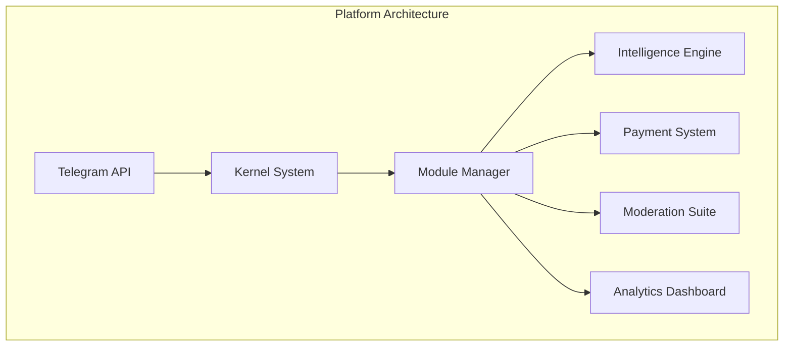
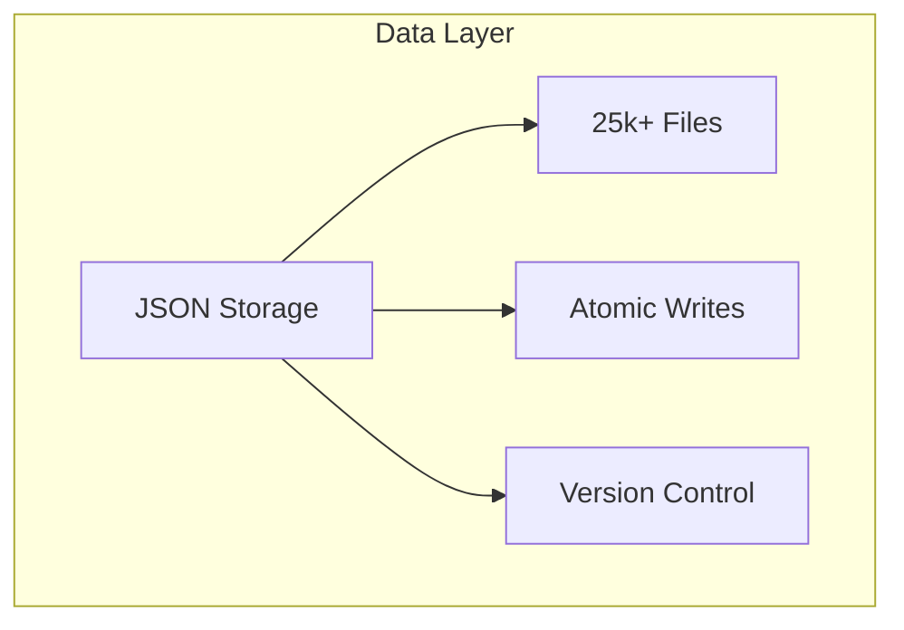
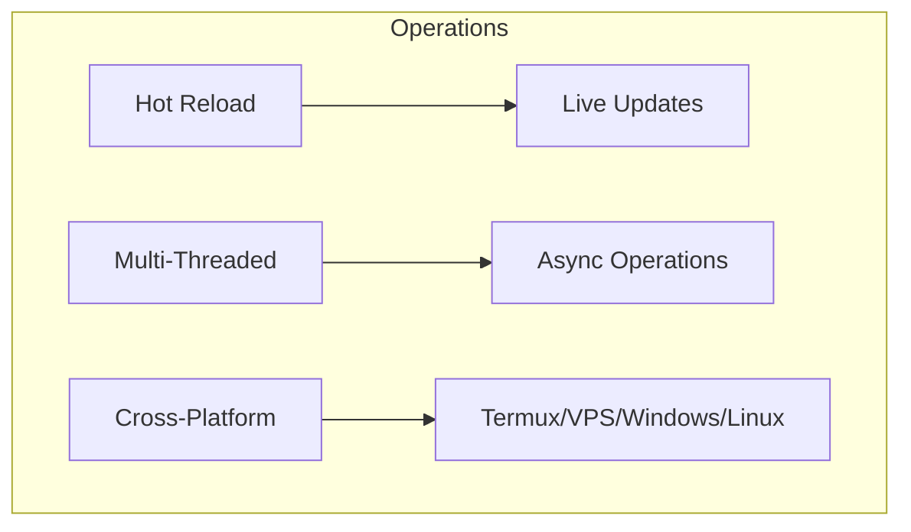

# 🌹 BLUE ROSE BOT 🌹
**Advanced Telegram Bot System with AI Intelligence & Complete Group Management**
<div align="center">
  


</div>

---
## 📋 TABLE OF CONTENTS
1. [✨ Features](#-features)
2. [🚀 Quick Start](#-quick-start)
3. [⚙️ Installation](#️-installation)
4. [🔧 Configuration](#-configuration)
5. [🏗️ Architecture](#️-architecture)
6. [📁 Project Structure](#-project-structure)
7. [🔐 Permissions](#-permissions)
8. [💳 Payments](#-payments)
9. [🤖 Intelligence](#-intelligence)
10. [📊 Analytics](#-analytics)
11. [🛡️ Security](#️-security)
12. [🚨 Failsafe](#-failsafe)
13. [👨‍💻 Developer](#-developer)

---
## ✨ FEATURES

### 🤖 **Core Platform**





### 🤖 CORE PLATFORM
- ✅ Unlimited groups/supergroups/channels support
- ✅ 1000+ modular architecture with hot-reload
- ✅ 25,000+ JSON files with atomic writes
- ✅ Multi-language: Bangla/English/Arabic/French/Urdu/Hindi
- ✅ Cross-platform: Termux/VPS/Windows/Linux/Docker
- ✅ No external API dependencies for core features

### 🧠 INTELLIGENCE ENGINE
- Smart auto-replies with 70%+ confidence threshold
- 10-message context memory per group
- Question-type detection & pattern matching
- Memory decay system (24-hour retention)

---
### 💳 PAYMENT SYSTEM

| Plan | Duration | Price | Features |
|------|----------|-------|----------|
| 🆓 Free Trial | 30 days | 0৳ | All features |
| 🟢 Basic | 30 days | 60৳ | Full access |
| 🔵 Standard | 90 days | 100৳ | Priority support |
| 🟣 Premium | 8 months | 200৳ | VIP features |

---

**Workflow:** Request → Manual Approval → Activation → Expiry Tracking

### 🛡️ MODERATION SUITE
- Anti-spam (5 messages/minute threshold)
- Anti-flood (10 messages/second threshold)
- Auto-warn → mute → ban escalation
- Link/forward/bot protection
- Raid detection & prevention

### 📊 ANALYTICS DASHBOARD
- Real-time group activity metrics
- Admin action auditing
- Payment conversion tracking
- System health monitoring
- Usage trends & reports

### 🚨 FAILSAFE SYSTEM
- Crash detection & auto-restart
- Data integrity verification
- Emergency lockdown mode
- Backup & restore capabilities
- Corruption recovery

---
## 🚀 QUICK START

### 1. PREREQUISITES
```bash
Python 3.12+
Telegram Bot Token (@BotFather)
Basic terminal knowledge
